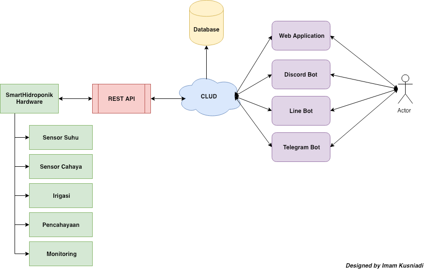

# TaniSpace IoT
It is a platform to assist in the management of plant culture by the hydroponic method. Our solution interconnects between Arduino, Web Base Application (RESTful API), and Chat Bot (Discord, Line, Messenger and Telegram). Use Artificial Intelligence in Chat Bot to provide a better user experience with the help of Dialogflow.com. Focus on making it easy for you to manage your plants wherever and whenever easily, but remember there must be an internet connection.

### Donate
- If this project very help you and u want support us , you can give us a cup of coffee :)
- 

## Workflow (In Bahasa)

## Features
- Monitoring pH, Light Value, Temperature & Humidity
- Real Time Reports in Graphical Form
- Controlling Plants Automatically And Manually
- Scheduling Irrigation and Automatic Nutrition
- Harvest Time Notification
- NLP (Neuro-linguistic programming) Chatbot As a Smart Assistant

## Sources
- SmartHidroponik-v1.ino - Manual Configuration Must Edit The Source Code
- SmartHidroponik-v2.ino - Easy Configure Without Edit The Code

## Librarys
- ArduinoJson
- WiFiManager
- ESP8266WiFi
- ESP8266HTTPClient
- DHT

## Hardwares

- NodeMCU ESP8266
- Light Sensor
- Temperature Sensor
- Relay
- Control Value
- Mini Pump (2 Seeds)
- Paralon Pipe
- 16 Analog Mux Channels
- Cables, etc.

## Documentation & More Information
**https://dashboard.tanispace.io/**

## Have Problem?
Join our Telegram discussion group **https://t.me/TaniSpace**

## Disclaimer

***Note: modifications, changes, or alterations to this sourcecode is acceptable, however,any public releases utilizing this code must be approved by writen this sourcecode.***
